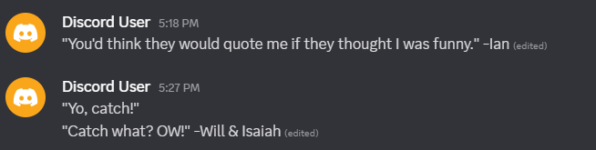
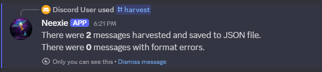
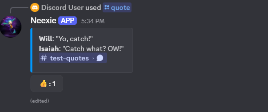
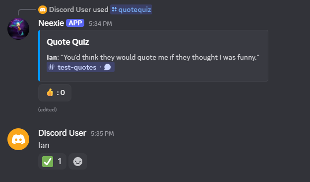
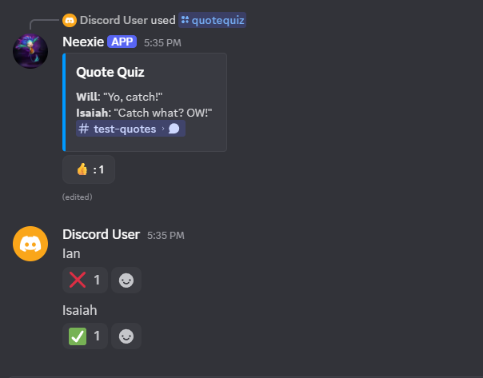
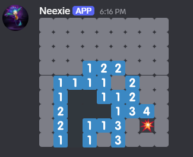
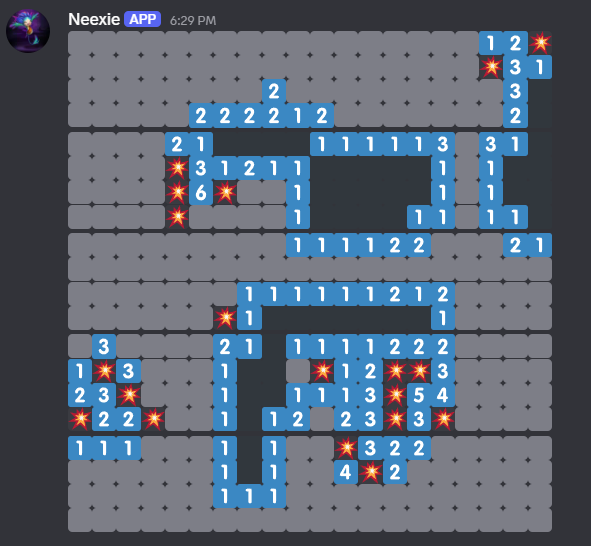
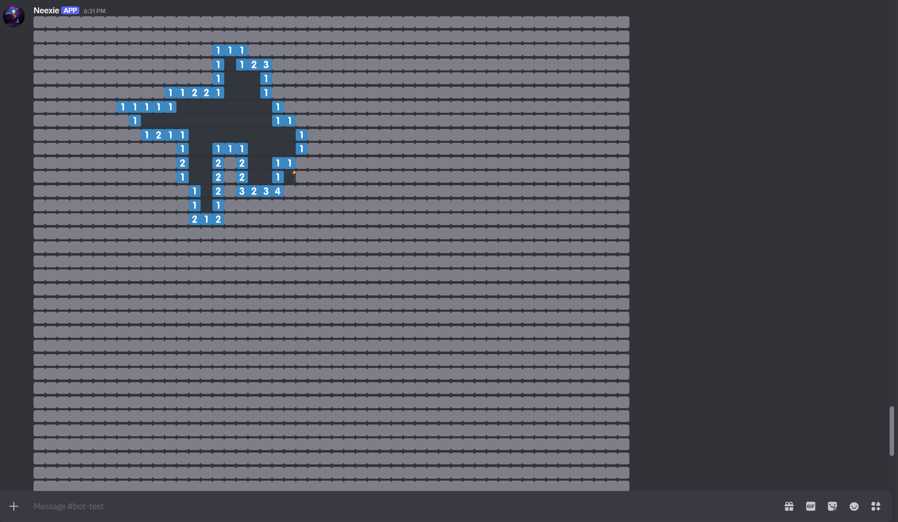

# Neexie-Showcase
A repository for showcasing a Node.js Discord bot I created named "Neexie".

---

## Overview
Neexie’s primary feature is a quiz system that randomly selects quotes from a channel and asks players to guess who said them. It also includes a small collection of interactive commands and games for entertainment as well as a few utility commands.

- Designed for a private Discord server  
- Focuses on modular, maintainable code architecture  
- Fully event-driven to handle multiple commands asynchronously  

---

## Features
- **Random Quote:** Displays a random submitted quote with a link to the original message and a "like" button
- **Quote Quiz:** Randomly picks quotes and quizzes players, asking them to guess the original speaker(s)
- **Quote Stats:** Can display a stats summary of number of quotes, who submitted the most, and who was quoted the most 
- **Disguise Message:** Can send a message disguised as another user (an "App" tag indicates the message is not from the real user)
- **Minesweeper:** A basic Minesweeper implementation utilizing Discord's spoiler text function
- **Data Management:** Persistent JSON storage for quotes and likes specific per server
- **Extensible:** Easily add new commands or quiz categories  

---

## Technical Highlights
- **Language / Framework:** Node.js with Discord.js  
- **Architecture:** Modular command handler, event-driven system  
- **Data Storage:** JSON files for lightweight persistence  
- **Version Control:** Git with private repo

---

## Screenshots / Demo

# Quote Use

*List of example quotes

*Neexie collecting the list of quotes and saving to a JSON file

*Neexie displays a random quote

*Neexie starts a quiz

*Neexie starts a quiz using a multi-speaker quote

-

# Disguise Message

*Neexie sends a message while disguised, note the "App" tag indicating that it is not a real user

-

# Minesweeper

*Neexie sends a message with a 9x9 minesweeper board using Discord's spoiler function on emojis

*An example of a larger 20x20 board that Neexie sends through multiple separate messages, to abide by Discord's API limits

*An example of the largest possible board, 50x50, each line sent separately

---

## Author
**Ian Anderson**  
Computer Science Graduate  
[Portfolio](https://andersoni0723.wixsite.com/ian-andersons-portfo) | [LinkedIn](https://www.linkedin.com/in/ian-anderson-66361625b/)